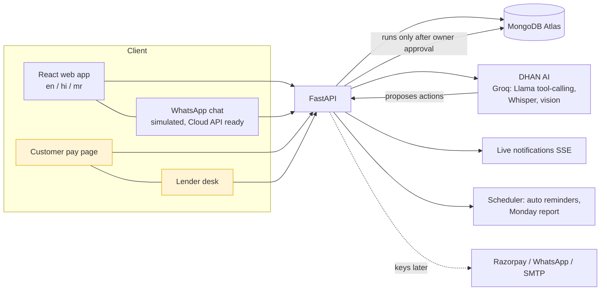

# DHAN pitch kit (Hack2Ignite 2026, PS FT-05)

## One-line problem
Small Indian businesses run on udhaar and WhatsApp, so they discover a cash crunch only after it hits, and banks can't see the healthy business hiding behind it.

## One-line answer
DHAN is the AI finance desk for small businesses: it tracks money by voice, chases udhaar, warns about cash crunches before they happen, fixes them with one-tap approved actions, and turns the books into a Credit Passport that unlocks loans.

## 3-minute demo script (login: Gowurk, 7410534319 / 12345678)

| Time | Screen | Say | Do |
|---|---|---|---|
| 0:00 | Slide | The one-line problem above. | - |
| 0:15 | Dashboard | "Gowurk is a home-services app. Founders see cash, 30-day outlook and money waiting, in one screen." | Point at cash hero, "Recovered by DHAN" strip. |
| 0:35 | Add > Speak | "A shopkeeper just talks." | Say in Hindi/Marathi: "शर्मा ट्रांसपोर्ट को 500 रुपये दिए". Form fills itself. Save. |
| 0:55 | WhatsApp bot | "Same thing on WhatsApp: text, voice note, or a bill photo." | Send "paid 500 to Sharma Transport for petrol", then "UNDO". |
| 1:15 | Receivables | "Udhaar is where money gets stuck." | Send a payment link. Open it in another tab as the customer, tap "I've paid". Watch the owner's bell light up live. |
| 1:50 | DHAN AI | "Will I run out of cash?" | Ask "Fix my cash crunch". Plan card appears: lowest cash before vs after. Tap **Approve all**. Reminders go out, a bill is pushed back. |
| 2:15 | Funding | "Their books are clean, so lenders compete." | Show offers and live EMI, open the approved application, open the lender desk link. |
| 2:40 | GST + Report | "GST payable, ITC, deadlines, and a Monday report written by DHAN AI." | Show GST page, then Weekly report. |
| 2:50 | Settings | "OTP login, read-only accountant role, full activity log." | Scroll to Team and Activity log. |
| 3:00 | Close | "Built for the 6 crore businesses the banks can't read." | - |

Safety line if asked: the AI only *proposes*; every action runs on the owner's approval, and every number comes from the database, never from model text.

## Business model (proposal, illustrative; validate before presenting)
- **Free**: ledger, voice entry, WhatsApp bot, 5 reminders/month.
- **Pro (about Rs 299-499/month per business)**: unlimited udhaar automation, cash-crunch actions, GST helper, weekly report, accountant seats.
- **Marketplace revenue**: lender referral fee per funded loan, invoice-discounting spread share.
- **Payments**: small fee on collected payments through the Razorpay link.
- Market sizing: use a sourced figure for number of MSMEs in India (verify the number and cite the source before it goes on a slide).

## Architecture

## Honest limits to state if asked
Lenders are fictional and nothing moves money; WhatsApp and email run in simulation until keys are added; the credit score is indicative, not CIBIL. Deploy, PWA/offline and more languages are next.
